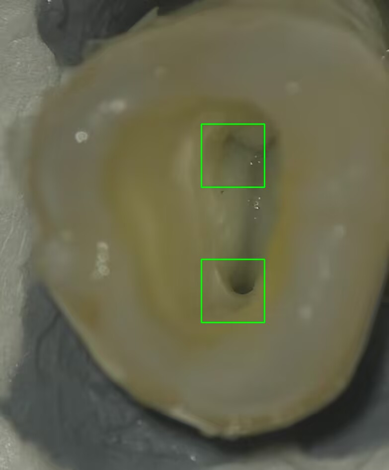

# 牙齿根管口检测

基于 C++ 与 OpenCV 实现的牙齿根管口检测课程项目。项目面向离体牙显微图像，完成牙齿区域预处理、牙髓室 ROI 提取、HOG 特征计算、SVM 滑动窗口检测以及非极大值抑制，最终在原图上标出可能的根管口位置。

> 说明：预训练 SVM 模型、测试图片、测试视频等数据由课程题目提供，因体积和使用范围限制，本仓库不上传这些文件。运行项目前请将课程提供的资源放回对应目录。

## 效果示例



## 功能

- 单张牙齿图像根管口检测
- 视频文件逐帧处理与结果视频导出
- 基于 K-Means、形态学操作和连通域分析的 ROI 提取
- 手动实现 HOG 特征计算与可视化
- 基于 OpenCV SVM 的滑动窗口分类
- Top-K 候选筛选与 NMS 非极大值抑制
- 自动创建检测结果输出目录

## 技术路线

```text
输入图像/视频帧
    ↓
统一尺寸到 1272 x 1080
    ↓
K-Means 分割牙齿与髓室区域
    ↓
形态学处理与连通域分析提取 ROI
    ↓
HOG 特征计算与 SVM 滑动窗口预测
    ↓
Top-K 筛选与 NMS 去重
    ↓
检测框映射回原图并输出结果
```

## 仓库结构

```text
.
├── README.md
├── docs/
│   └── example_detection.png
├── 根管口检测.sln
└── 根管口检测/
    ├── main.cpp
    ├── canvas.cpp
    ├── canvas.h
    ├── preprocess.cpp
    ├── preprocess.h
    ├── hogprocess.cpp
    ├── hogprocess.h
    ├── svmprocess.cpp
    ├── svmprocess.h
    ├── videoprocess.cpp
    ├── videoprocess.h
    ├── 根管口检测.vcxproj
    └── 根管口检测.vcxproj.filters
```

本仓库不包含以下课程资源：

```text
根管口检测/64_svm_model.xml
根管口检测/128_svm_model.xml
根管口检测/test/
根管口检测/vid.mp4
```

如果需要完整运行，请从课程资料中取得上述文件，并按同名路径放置。

## 环境要求

- Windows
- Visual Studio 2022
- MSVC v143
- OpenCV

当前工程使用 Visual Studio C++ 项目文件管理源码。项目配置中曾使用如下本机 OpenCV 路径：

```text
D:\openCV\opencv\build\include
D:\openCV\opencv\build\x64\vc16\lib
```

如果你的 OpenCV 安装路径不同，需要在 Visual Studio 中修改：

- `C/C++ -> 常规 -> 附加包含目录`
- `链接器 -> 常规 -> 附加库目录`
- `链接器 -> 输入 -> 附加依赖项`

Debug 配置通常链接 `opencv_worldxxxxd.lib`，Release 配置通常链接 `opencv_worldxxxx.lib`，请按本机 OpenCV 版本调整文件名。

## 数据与模型准备

程序默认在运行目录下加载：

```text
64_svm_model.xml
```

建议将课程提供的模型文件放在项目目录：

```text
根管口检测/64_svm_model.xml
根管口检测/128_svm_model.xml
```

测试图片可放入：

```text
根管口检测/test/
```

测试视频可放入：

```text
根管口检测/vid.mp4
```

## 构建方法

1. 使用 Visual Studio 打开 `根管口检测.sln`。
2. 选择 `Debug | x64` 配置。
3. 检查并修改 OpenCV include/lib 路径。
4. 生成解决方案。
5. 将模型文件放到程序运行目录，或将 Visual Studio 调试工作目录设置为 `根管口检测/`。

## 运行方法

程序启动后会显示菜单：

```text
============================
 Root Canal Detection Menu
============================
1. Image mode
2. Video mode
3. Exit
Select mode:
```

### 图片模式

选择 `1. Image mode`，输入图片相对路径，例如：

```text
test\45.1.png
```

输出目录：

```text
result\image\<输入文件名>\
```

主要输出：

```text
detected.png
HOG特征图.png
梯度大小图.png
```

### 视频模式

选择 `2. Video mode`，输入视频相对路径，例如：

```text
vid.mp4
```

输出文件：

```text
result\video\<输入文件名>_result.mp4
```

## 核心模块

| 文件 | 作用 |
|---|---|
| `main.cpp` | 程序入口 |
| `canvas.cpp/.h` | 控制台菜单、图片模式、视频模式、结果目录管理 |
| `preprocess.cpp/.h` | K-Means 分割、牙齿 ROI 与髓室 ROI 提取 |
| `hogprocess.cpp/.h` | 手动 HOG 特征计算与可视化输出 |
| `svmprocess.cpp/.h` | SVM 模型加载、滑动窗口检测、Top-K 筛选、NMS 与结果绘制 |
| `videoprocess.cpp/.h` | 视频读取、帧处理和结果视频写出 |

## 实现细节

- 输入图像统一缩放为 `1272 x 1080`。
- ROI 提取阶段将图像转换到 Lab 色彩空间，并使用 K-Means 得到牙齿区域与髓室候选区域。
- HOG 可视化部分在 RGB ROI 上分别计算三个通道梯度，选取最大梯度幅值作为当前像素响应。
- SVM 检测阶段使用灰度 ROI 与 OpenCV `HOGDescriptor` 生成窗口特征。
- 当前滑动窗口大小为 `128 x 128`，步长为 `16`。
- SVM 原始分数越小，候选框越可能为目标。
- 候选框先按分数取 Top-K，再使用 IoU 阈值进行 NMS。

## 免责声明

本项目为课程作业与图像处理学习项目，仅用于算法实践和实验展示，不可作为医学诊断或临床治疗依据。
